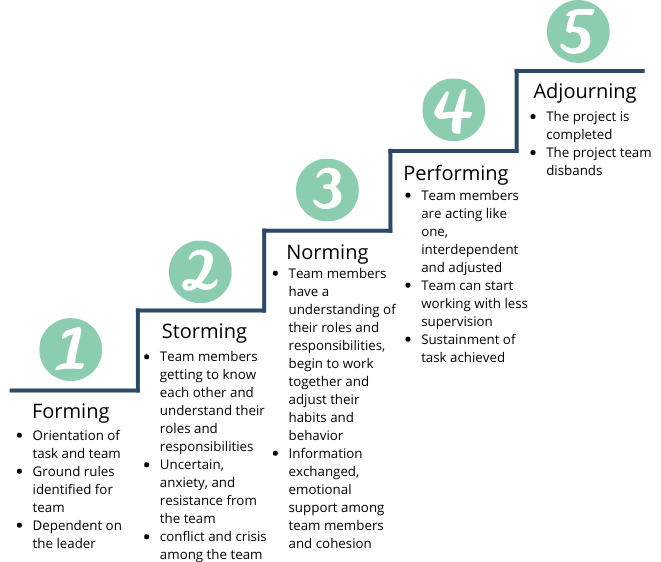
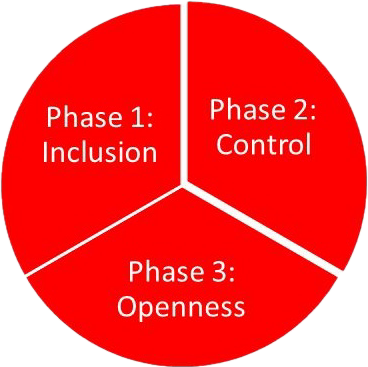

# Teamets faser

    

        

            <h3>Tuckmans modell</h3>
            
        

        

            <h3>FIRO modellen</h3>
            
        

    

<!-- 
Det finnes fryktelig mange meninger og modeller for fasene et team eller en gruppe går igjennom. Her har vi et par velkjente som vi ønsker å trekke frem.
Den første er kjent som Tuckmans stages of group development. De ulike fasene er trukket frem som nødvendige faser et team må gå igjennom for å vokse, takle problemer og levere resultater.
Det er vanskelig å si seg uenig i de ulike fasene, men modellen kan minne om fossefallsmodellen, og det å bygge et team er ingen 'one and done' prosess. 

Derfor ønsker vi å trekke frem en annen modell som belyser mye av det samme, men med en mer kontinuerlig tilnærming. 
Denne modellen har et større fokus på at det å bygge team er en syklus som gjør at man kan gå tilbake til tidligere steg når teamet møter endringer.  
 -->
---
layout: two-cols-header
---

# Hvordan oppnå et godt fungerende team
::left::
# Sosialt
<v-clicks depth="2">

- Finne sin rolle
    - uoffisiell
    - offisiell
- Gå inn som deg selv

</v-clicks>

::right::
# Løse oppdrag
<v-clicks depth="2">

- Sette i fellesskap*: 
    - Rammer
    - Mål
    - Danne eierskap

</v-clicks>

<!-- 
Husk å nevne at dette er en kontinuerlig prosess som må gjøres hver gang det skjer utskiftninger i teamet.
 -->

