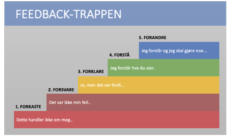

# Hvorfor gode tilbakemeldinger er viktig

<ul>
<li>Psykologisk trygget</li>
<li>Tettsamarbeid</li>
<li>Velfungerende team</li>
</ul>

Hvis du gir gode tilbakemeldinger til dine kollegaer, vil de føle seg trygge. Dette er viktig for at de skal kunne yte sitt beste. Det er også da vi forbedre oss og kan utvikle oss som et team

Men hva er egentlig en god tilbakemelding?
En god tilbake melding er både positiv og konstruktiv. Den er skal komme for at en person skal kunne forbedre seg.

---
transition: slide-up
---

# Gi en god tilbakemelding

"MAL" :
<ul>
<li>Når du ....</li>
<li>Så føler jeg ....</li>
<li>Dette fører til ...</li>
</ul>

"Regler" : 
<ul>
<li>Vær presis</li>
<li>Kom med konkrete grunner og eksempler</li>
<li>Ikke bruk annen tilbakemelding til å gjemme verken den positive eller den konstruktive</li>
<li>Ikke vær slem, tilbakemeldinger skal komme fra et sted hvor man vil at motakeren skal vokse og bli bedre</li>
</ul>

---

# Få en god tilbakemelding

<ul>
<li>Ta det for det det er</li>
<li>Ikke over tenkt</li>
<li>Ikke kom med unnskyldninger</li>
<li>Lytt</li>
</ul>

